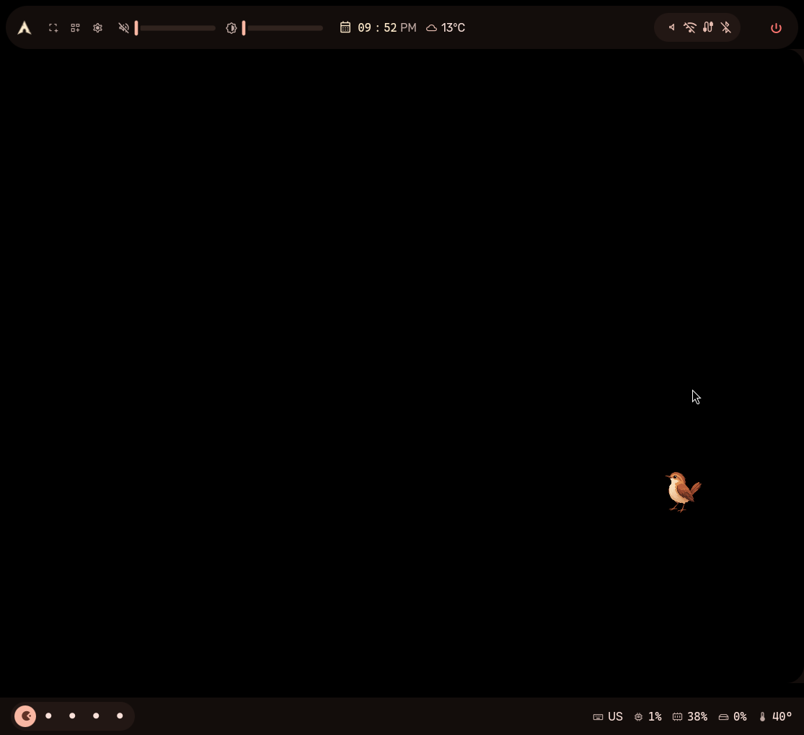
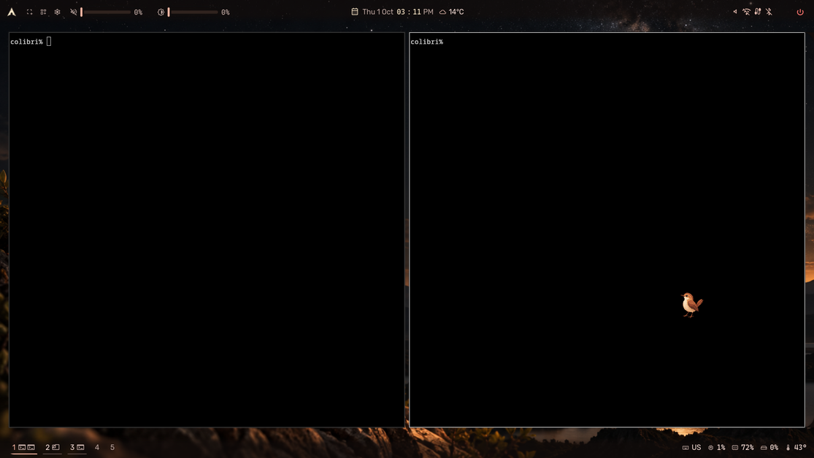
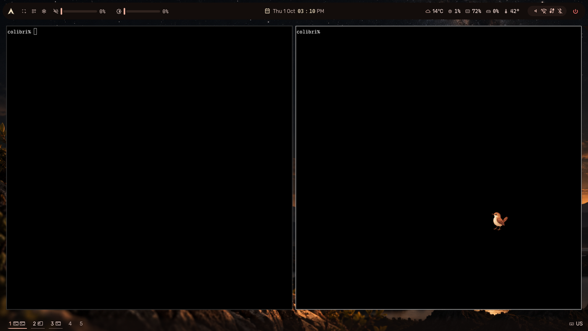
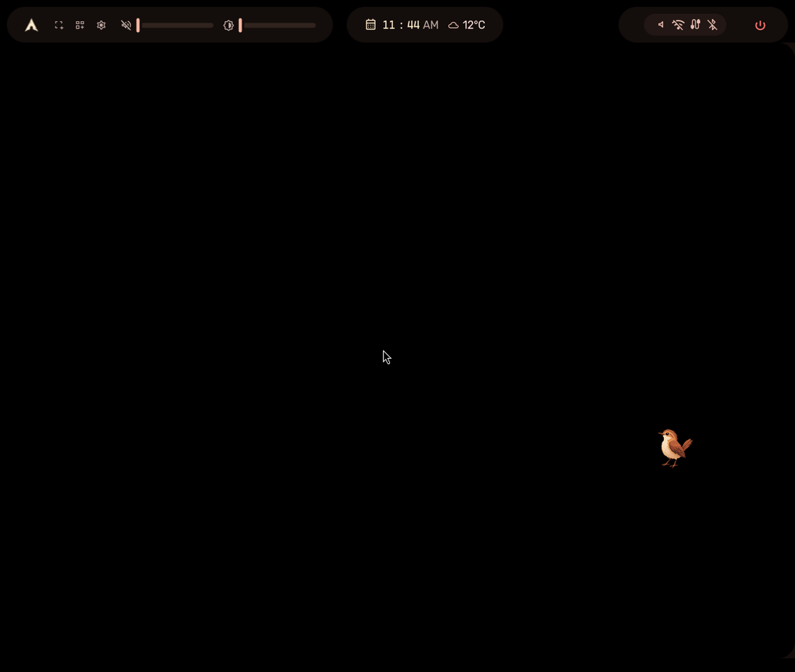
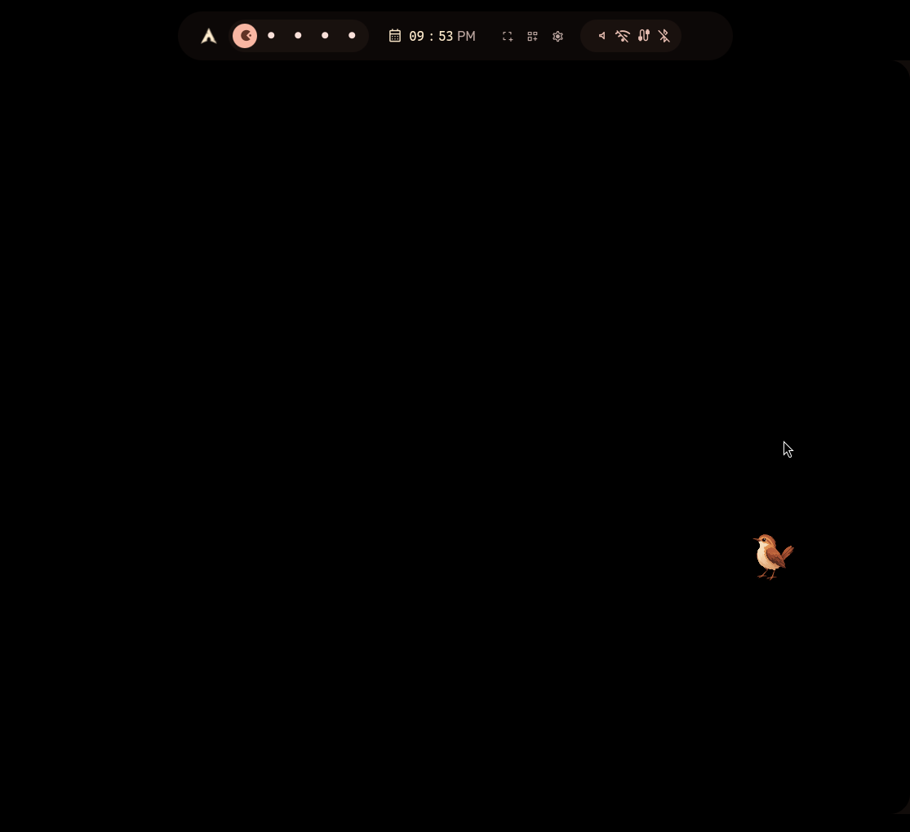
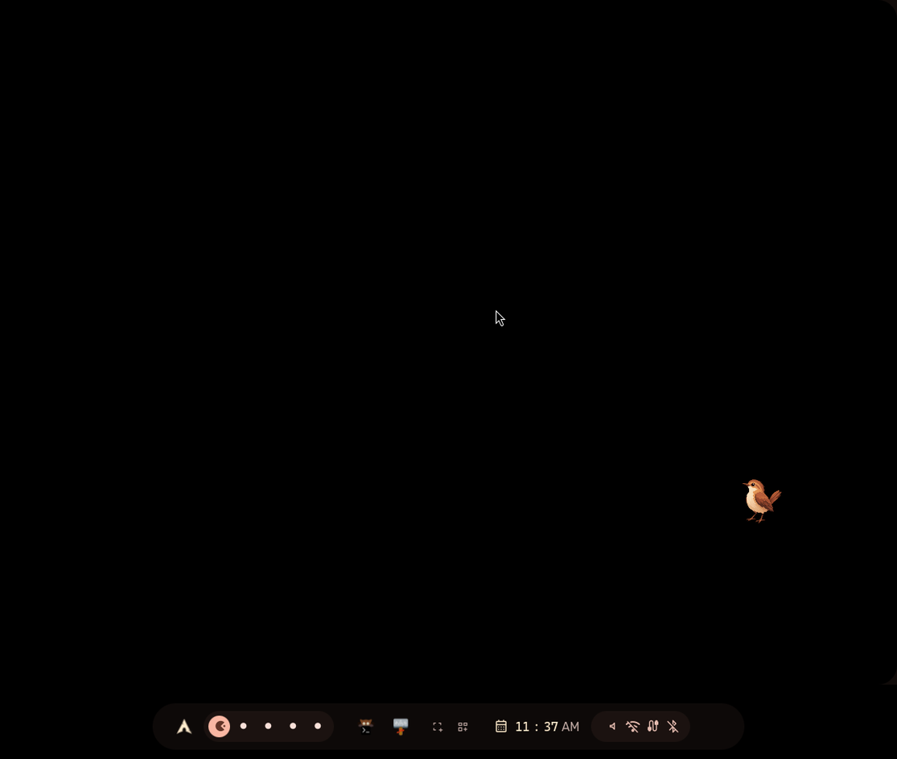
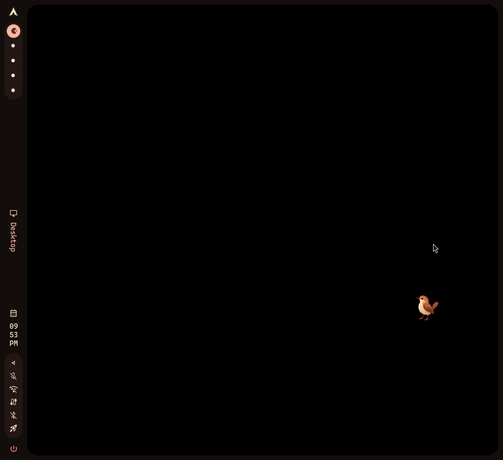

# Layouts — bar schema v2

Multi-bar layouts for the Hornero shell: a set of bars, at most one per
screen edge, each split into `start`/`center`/`end` groups. Schema lives in
`config/BarConfig.qml`, rendering in `modules/bar/Bar.qml` (+ `BarSet.qml`,
`BarWrapper.qml`), presets in `presets/*.json`.

## Schema

`bar.bars` is a list of bar specs. Empty (or all invalid) means the legacy
single bar is synthesized from `bar.position`/`bar.style`/`bar.entries`, so
every v1 preset and user `shell.json` keeps working unchanged.

```json
"bars": [
  {
    "edge": "top",
    "style": "inset",
    "margin": 8,
    "thickness": 40,
    "reserve": true,
    "density": "values",
    "groups": {
      "start": [{"id": "logo", "enabled": true}],
      "center": [{"id": "clock", "enabled": true}],
      "end": [{"id": "tray", "enabled": true}]
    }
  }
]
```

| Field       | Values / range                                    | Default                        |
|-------------|---------------------------------------------------|--------------------------------|
| `edge`      | `top` `bottom` `left` `right`                     | required (spec dropped if bad) |
| `style`     | `attached` `inset` `floating` `islands` `dock`    | `attached`                     |
| `margin`    | 0–256 px                                          | `bar.floatingMargin`           |
| `thickness` | 16–256 px                                         | `bar.sizes.innerWidth`         |
| `reserve`   | bool                                              | reserving styles only (below)  |
| `density`   | `values` `glyphs`                                 | `values`                       |
| `backdrop`  | `solid` `clear`                                   | `solid`                        |

Resolution (`BarConfig.barsFor`): per-screen `bars` override wins, else the
global set; invalid specs are dropped, the first spec wins on a duplicated
edge, and an unusable set falls back to the synthesized legacy bar so the
user always keeps desktop chrome.

Styles:

- `attached` — full-edge strip reserving space.
- `inset` — strip with a margin gap kept inside the reserved zone.
- `floating` — centered pill, reserves nothing.
- `islands` — one floating pill per non-empty group (start left, center
  centered, end right); reserves nothing.
- `dock` — floating pill that still reserves space.
- The islands, cozy-minimal and floating-island presets set `reserve: true`
  explicitly: their Polybar/Waybar ancestors reserved space, and overlaying
  pills hid the first line of every window under them.
- `reserve` defaults to true for `attached`, `inset` and `dock`, false for
  `floating` and `islands` (`BarConfig.styleReserves`, single source of
  truth). An explicit `reserve` on the spec always wins: `reserve: false`
  makes any style overlay clients, `reserve: true` makes a pill behave
  like a dock (full-edge exclusive zone, windows stop at the strip).

`backdrop: "clear"` paints no slab and opens the frame on that edge
(`BarSet.openOn`), so components sit on the wallpaper the way the
transparent Polybar bars did. A soft edge scrim keeps them legible; its
strength follows the `bar` transparency element (Appearance), so setting
that element to 0 removes it. Geometry and reservation are unchanged, and
popouts from a clear bar always render as cards.

Narrow horizontal bars (under 1500px) compact wide components (inline
sliders shorten), and a strip's centre group hides rather than overlap its
neighbours when it cannot fit — the same rule islands use.

Horizontal bars span the full width; vertical bars sit between them, so a top
bar and a left rail never overlap. `density: "glyphs"` hides numeric text in
`resources`, `battery` and `weather` (icons carry the level).

## Entries

Groups hold `{id, enabled, options?}`. `id` must be a delegate registered in
`Bar.qml` (`spacer` is v1-only; v2 splits groups explicitly).

| id                 | Component          | `options`                                    |
|--------------------|--------------------|----------------------------------------------|
| `logo`             | OsIcon             | —                                            |
| `workspaces`       | Workspaces         | `style`: `pills` (default) or `labels`       |
| `activeWindow`     | ActiveWindow       | —                                            |
| `tray`             | Tray               | —                                            |
| `clock`            | Clock              | `showDate` (overrides `bar.clock.showDate`)  |
| `statusIcons`      | StatusIcons        | —                                            |
| `audioSlider`      | InlineSlider       | `showValue` (level as `72%`)                 |
| `brightnessSlider` | InlineSlider       | `showValue`                                  |
| `power`            | Power              | —                                            |
| `media`            | Media              | `maxWidth` (default 280), `showWhenIdle`     |
| `resources`        | Resources          | `show`: subset of cpu, memory, disk, temp    |
| `kbLayout`         | KbLayout           | —                                            |
| `weather`          | WeatherChip        | —                                            |
| `pinnedApps`       | PinnedApps         | `apps`: desktop-entry ids (required)         |
| `quickActions`     | QuickActions       | `actions`: ShellActions ids (required)       |
| `battery`          | Battery            | —                                            |

Workspaces `labels` style shows each workspace's number and app glyphs
with an underline on the bar's inner side: thick accent for the active
workspace, thin neutral for occupied ones (state is carried by thickness
as well as colour). No pill or occupied background is drawn.

Interactive entries are built on `BarButton` (one `Interactive`: Tab stop,
Enter/Space, focus ring, accessible name). `media`, `pinnedApps`, `battery`
and `weather` collapse when they have nothing to show, so layouts can
include them unconditionally.

## ShellActions

`services/ShellActions.qml` owns what bar buttons do. Presets name an action
id, never a command string; unknown ids warn and are skipped.

| id             | Effect                                  |
|----------------|-----------------------------------------|
| `launcher`     | toggle launcher                         |
| `layoutPicker` | toggle layout picker                    |
| `dashboard`    | toggle dashboard                        |
| `session`      | toggle session menu                     |
| `settings`     | open Settings window (`settingsRequested` → Shortcuts) |
| `screenshot`   | start area capture (`screenshotRequested` → AreaPicker) |

Signals (not imports) cross the services/modules boundary: services never
import modules, so the owning modules handle `settingsRequested` and
`screenshotRequested`.

## Presets

15 presets (`tests/test_shell_layout.py` locks the count and the schema).
Each keeps a v1 fallback — legacy `position`/`style`/`entries` describing
the primary bar — so older `horneroctl` validators and the layout-picker
preview (primary bar only) keep working. `bar.style` must stay a v1 style
(`attached`/`floating`/`dock`); the v2 style lives on the spec.

| Preset          | Bars                              | Lineage                        |
|-----------------|-----------------------------------|--------------------------------|
| `cockpit`       | top inset + bottom attached       | Polybar + Waybar default       |
| `cockpit-clear` | top + bottom attached, clear      | Polybar default (X11, transparent) |
| `horizon`       | top inset + bottom attached clear | Polybar top-only profile       |
| `islands`       | top islands, reserved             | Polybar i3 multipart           |
| `cozy-minimal`  | top floating, reserved            | Waybar cozy-minimal            |
| `dock-bottom`   | bottom dock                       | Waybar dock-bottom             |
| `hornero-left`  | v1 left attached                  | current reference shell        |
| `hornero-right` | v1 right attached                 | current reference shell        |
| `minimal-left`  | v1 left attached                  | —                              |
| `minimal-top`   | v1 top attached                   | —                              |
| `classic-top`   | v1 top attached                   | —                              |
| `classic-bottom`| v1 bottom attached                | —                              |
| `floating-island`| top floating, reserved           | Waybar floating-neon geometry  |
| `gaming`        | v1 bottom floating                | —                              |
| `productivity`  | v1 top attached                   | —                              |

## Gallery

Captured in nested Hyprland with the welcome window dismissed, official
dark wallpaper, scaled to 1115px wide. Cockpit, Cockpit Clear, Horizon,
Islands and Cozy Minimal are from the backdrop/options change; Dock Bottom
and Hornero Left are earlier captures:

- 
- 
- 
- 
- 
- 
- 

## Persistence

`bars` is serialized by `Config.qml` (`serialize*`) and present in the
factory default (`config/shell.default.json`); `tests/test_config_serializer.py`
walks the schema dynamically, so new bar keys are covered as long as both
sides name them.

## Follow-ups

- None open for the picker: previews draw every bar from the `bars`
  topology `horneroctl shell preset list --full` reports (strip, inset,
  floating, islands, dock, clear; one dot per enabled component), with
  the legacy primary-bar fallback for older horneroctl builds.
